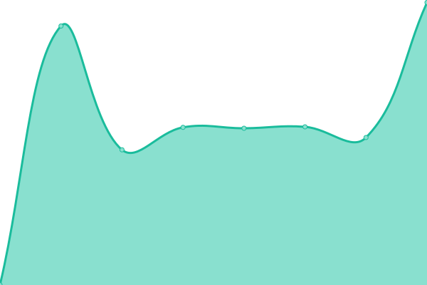

# [📈 Live Status](https://pioneer-dynamics.github.io/status.flashview.link): <!--live status--> **🟩 All systems operational**

This repository contains the open-source uptime monitor and status page for [Pioneer Dynamics](https://pioneer-dynamics.github.io/status.flashview.link), powered by [Upptime](https://github.com/upptime/upptime).

With [Upptime](https://upptime.js.org), you can get your own unlimited and free uptime monitor and status page, powered entirely by a GitHub repository. We use [Issues](https://github.com/pioneer-dynamics/status.flashview.link/issues) as incident reports, [Actions](https://github.com/pioneer-dynamics/status.flashview.link/actions) as uptime monitors, and [Pages](https://pioneer-dynamics.github.io/status.flashview.link) for the status page.

<!--start: status pages-->
<!-- This summary is generated by Upptime (https://github.com/upptime/upptime) -->
<!-- Do not edit this manually, your changes will be overwritten -->
<!-- prettier-ignore -->
| URL | Status | History | Response Time | Uptime |
| --- | ------ | ------- | ------------- | ------ |
|  [FlashView Application Server](https://flashview.link) | 🟩 Up | [flash-view-application-server.yml](https://github.com/pioneer-dynamics/status.flashview.link/commits/HEAD/history/flash-view-application-server.yml) | 

 831ms
     
 | 

<a href="https://status.flashview.link/history/flash-view-application-server">100.00%</a>
    

|  [FlashView UI Server](https://static.portion.ist/build/manifest.json) | 🟩 Up | [flash-view-ui-server.yml](https://github.com/pioneer-dynamics/status.flashview.link/commits/HEAD/history/flash-view-ui-server.yml) | 

 524ms
     
 | 

<a href="https://status.flashview.link/history/flash-view-ui-server">99.32%</a>
    

<!--end: status pages-->

[**Visit our status website →**](https://pioneer-dynamics.github.io/status.flashview.link)

## 📄 License

- Powered by: [Upptime](https://github.com/upptime/upptime)
- Code: [MIT](./LICENSE) © [Anand Chowdhary](https://anandchowdhary.com), supported by [Pabio](https://pabio.com)
- Data in the `./history` directory: [Open Database License](https://opendatacommons.org/licenses/odbl/1-0/)
